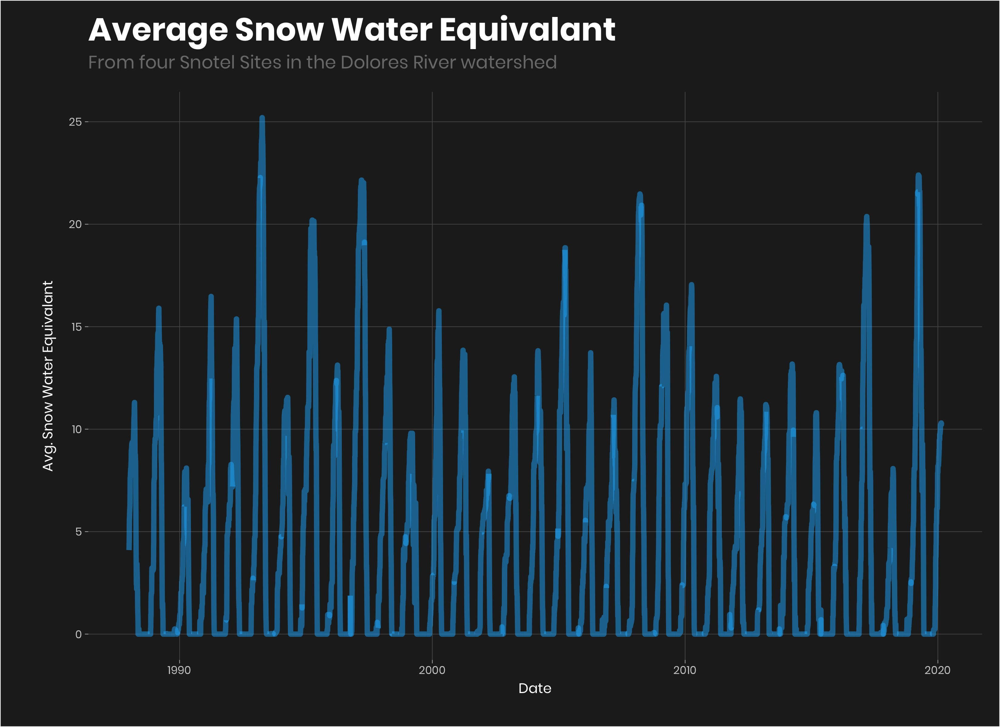

## Load Packages

``` r
library(tidyverse) ## For all the data cleaning work.
library(lubridate) ## For working with dates. 
library(extrafont) ## For Font Graphics
library(kableExtra)
theme_set(theme_light())

t<-theme_light()+
  theme(
    text=element_text(family = "Poppins", color = "#FFFFFF"),
    plot.margin = unit(c(0.5,0.5,0.5,0.5), "cm"),
    plot.title = element_text(face = "bold", size = rel(2.3), color = "#FFFFFF"),
    plot.subtitle = element_text(color = "#7A7A7A", size = rel(1.3), margin = margin(t = 0, r = 0, b = 15, l = 0)),
    plot.background = element_rect(fill = "#222222", color = "#FFFFFF"),
    panel.grid.major = element_line(color = "#555555"),
    panel.grid.minor = element_blank(),
    panel.background = element_rect(fill = "#222222", color = "#222222"),
    panel.border = element_blank(),
    axis.text = element_text(size = rel(0.8), colour = "#CCCCCC"),
    axis.title.x = element_text(margin = margin(t = 5, r = 0, b = 10, l = 0)),
    axis.title.y = element_text(margin = margin(t = 0, r = 10, b = 0, l = 20)),
    legend.title = element_text(face = "bold"),
    legend.text = element_text(color = "#222222"),
    legend.direction = "horizontal",
    legend.position="bottom",
    legend.key.width = unit(5, "cm"),
    legend.key.height = unit(0.3, "cm"),
    legend.box = "vertical",
    plot.caption = element_text(color = "#7A7A7A", size = rel(0.9))
  ) 
theme_set(t)
```

# Getting a variable to predict

### Getting Stream Guage Data Below McPhee Dam from the USGS

``` r
url<-paste0("https://waterservices.usgs.gov/nwis/dv/?format=rdb&sites=09169500,%2009166500&startDT=1985-02-01&endDT=", Sys.Date(), "&statCd=00003&siteType=ST&siteStatus=all")

flow_data<-read_tsv(url, skip = 35)%>%
  select(2:5)%>%
  rename(site_id = 1, date = 2, flow=3, code = 4)%>%
  mutate(site_id = ifelse(site_id == "09166500", "Dolores", "Bedrock"))%>%
  drop_na()

bedrock_flow<-flow_data%>%
  filter(site_id == "Bedrock"& year(date)>1986)%>%
  select(-code)

bedrock_flow
```

    ## # A tibble: 12,085 x 3
    ##    site_id date        flow
    ##    <chr>   <date>     <dbl>
    ##  1 Bedrock 1987-01-01   120
    ##  2 Bedrock 1987-01-02   130
    ##  3 Bedrock 1987-01-03   120
    ##  4 Bedrock 1987-01-04   120
    ##  5 Bedrock 1987-01-05   140
    ##  6 Bedrock 1987-01-06   140
    ##  7 Bedrock 1987-01-07   130
    ##  8 Bedrock 1987-01-08   130
    ##  9 Bedrock 1987-01-09   110
    ## 10 Bedrock 1987-01-10    95
    ## # … with 12,075 more rows

I want to predict the raftable days released below McPhee Dam. To do this I need flow data from a gauge below McPhee Dam. There are a few to choose from, but the oldest is at Bedrock, CO. To get the data I used the USGS Water Services REST API. There’s an R package that you can used to get the data, but since I’d used the API a few times before and I knew that the data could be returned in tab-separated format, I just used the `readr` function `read_tsv()`. \* The first step is to build the URL for the API. I used the USGS Rest API builder tool to get the right data. I concatenated in todays data using `Sys.Date()` function. \* Then used the `read_tsv()` function to pull data from the API skpping the first 35 lines of comments. \* We then rename the columns to something we can understand. \* And then convert the site\_ids to Characters instead of numbers. I pulled data from above and below the dams because at the time I thought I might use the data from above the Dam later for another predictive variable. \* The I drop all the missing values. \* Then I subset the data to just below the dam.

### Visualize the flow

``` r
bedrock_flow%>%
  filter(year(date)>2007)%>%
  ggplot(aes(date, flow))+
  geom_line(color = "#1AB8FF", size =1.2, alpha = 0.6)+
  labs(title = "Dolores Flows from 2008 to Present",
       subtitle = "USGS Flow Gauge Site 09169500 Near Bedrock, Colorado",
       caption = "Data aquired from the Bureau of Reclemation using the RNRCS package.",
       y = "Flow Rate (cfs)",
       x = "Year")
```

<!-- -->

I know from living here that the Dolores has flash flood events in the monsoon season giving the river raftable flows that are not produced by a Dam release. I want to remove these events from the prediction because they could alter our predictive variable.

### Subsetting the release

``` r
predicted_variable<-bedrock_flow%>%
  filter(flow>1000 & month(date) %in% c(3:7))%>%
  count(year(date))%>%
  rename(year = 1, raftable_releases = 2)

predicted_variable
```

    ## # A tibble: 19 x 2
    ##     year raftable_releases
    ##    <dbl>             <int>
    ##  1  1987                81
    ##  2  1988                 8
    ##  3  1992                37
    ##  4  1993                88
    ##  5  1994                26
    ##  6  1995                79
    ##  7  1997                72
    ##  8  1998                58
    ##  9  1999                16
    ## 10  2000                 7
    ## 11  2005                47
    ## 12  2007                 3
    ## 13  2008                49
    ## 14  2009                13
    ## 15  2010                 6
    ## 16  2011                10
    ## 17  2016                 5
    ## 18  2017                53
    ## 19  2019                37

To get the number of raftable release we subset the flow rates to flows above 1000 (cfs - cubic feet per second). The Dolores is ratable at 800 cfs, but because bedrock is about 100 miles below the dam and runoff could increase the flows I wanted to give the predictive variable a bit of a buffer.

  - First we filter the data for flows above 1000 cfs and dated from March to July (most of the monsoons occur from august to October).
  - Then we simply count the number of dates that are left by year.

We now have the variable we want to predict. Now we need predicters.

# Getting the predictive variables.

## Snow Depth

### Finding All Snotel Sites in the Dolores Watershed

``` r
library(RNRCS)
meta_data<-grabNRCS.meta(ntwrks = c("SNTL", "SNTLT", "SCAN"))

meta_data_unlist<-meta_data[[1]]%>%
  as_tibble()

meta_data_unlist
```

    ## # A tibble: 876 x 13
    ##    ntwk  wyear state site_name ts    start enddate latitude longitude
    ##    <chr> <fct> <fct> <chr>     <fct> <fct> <fct>   <fct>    <fct>    
    ##  1 SNTL  2019  AK    Frostbit… ""    2019… 2100-J… "  61.7… -149.27  
    ##  2 SNTL  2019  AK    McGrath   ""    2019… 2100-J… "  62.9… -155.61  
    ##  3 SNTL  2019  UT    Parleys … ""    2019… 2100-J… "  40.7… -111.61  
    ##  4 SNTL  2018  AK    East Pal… ""    2018… 2100-J… "  61.6… -149.10  
    ##  5 SNTL  2018  AK    Galena AK ""    2018… 2100-J… "  64.7… -156.71  
    ##  6 SNTL  2018  MT    JL Meadow ""    2017… 2100-J… "  44.7… -113.12  
    ##  7 SNTL  2018  NV    ONeil Cr… ""    2018… 2100-J… "  41.8… -115.08  
    ##  8 SNTL  2017  AK    Flower M… ""    2017… 2100-J… "  59.4… -136.28  
    ##  9 SNTL  2017  CA    Fredonye… ""    2016… 2100-J… "  40.6… -120.61  
    ## 10 SNTL  2017  UT    Bobs Hol… ""    2016… 2100-J… "  38.9… -112.15  
    ## # … with 866 more rows, and 4 more variables: elev_ft <fct>, county <fct>,
    ## #   huc <fct>, site_id <chr>

The first step in getting data from the a Snotel site is figuring out what sites you need data from. So the first step was to get a list of Snotel Sites in the US and then subset the sites to just the one that I need.

**grabNRCS.meta** - grabs all sites within the Snotel (“SNTL”), Snotel Lite, (“SNTLT”), and Scan (“SCAN”) systems. I’m really just interested in the snotel sites, but I wasn’t really sure what Snotel Lite or Scan was so I loaded them just in case. `grabNRCS` returns a single list, se we subset just the first item of the list.

``` r
dolores_sites<-meta_data_unlist%>%
  filter(state =="CO", str_detect(huc, "140300"))%>%
  mutate(site_id_num = as.numeric(str_match_all(site_id, "[0-9]+")))

dolores_sites
```

    ## # A tibble: 6 x 14
    ##   ntwk  wyear state site_name ts    start enddate latitude longitude
    ##   <chr> <fct> <fct> <chr>     <fct> <fct> <fct>   <fct>    <fct>    
    ## 1 SNTL  2011  CO    Black Me… ""    2011… 2100-J… "  37.7… -108.18  
    ## 2 SNTL  2005  CO    Sharksto… ""    2004… 2100-J… "  37.5… -108.11  
    ## 3 SNTL  1986  CO    El Dient… ""    1985… 2100-J… "  37.7… -108.02  
    ## 4 SNTL  1986  CO    Scotch C… ""    1985… 2100-J… "  37.6… -108.01  
    ## 5 SNTL  1980  CO    Lizard H… ""    1979… 2100-J… "  37.8… -107.92  
    ## 6 SNTL  1980  CO    Lone Cone ""    1979… 2100-J… "  37.8… -108.20  
    ## # … with 5 more variables: elev_ft <fct>, county <fct>, huc <fct>,
    ## #   site_id <chr>, site_id_num <dbl>

**dolores\_sites** - We then filter all sites in Colorado (“CO”) and detect all of the huc values with 140300. To pull data from the sites we will need a site ID number. The Meta data has the site IDs in a string that contains characters and numbers.

``` r
dolores_site_ids<-dolores_sites%>%
  pull(site_id_num)%>%
  unlist()%>%
  as.numeric()

dolores_site_ids
```

    ## [1] 1185 1060  465  739  586  589

**dolores\_site\_ids** - The last step is to convert the `site_id_num` variable into a vector so that we can pull data from each site in the next step.

## Pulling the data from the snotel sites

### Function to Pull All Sites

First we need a function that we can inject to pull data for each of our sites. `grabNRCS.data` does not allow you to pull data from more than one site at a time. So we need a function that we can use as we loop over our vector of `site_ids`.

``` r
get_snotl_data<-function(site_id){
  grabNRCS.data(network = "SNTL", 
              site_id = site_id, 
              timescale = "daily", 
              DayBgn = '1985-01-01',
              DayEnd = Sys.Date()
              )%>%
    as_tibble()%>%
    mutate(site_id_num = site_id)
}
```

To get data from each site we need to use `grabNRCS.data()` function. `grabNRCS.data` takes: \* network - the network we want to pull from. \* the Site ID which we produced a list of in the last step. \* DayBgn - The first day you want to pull data from. \* DayEnd - the Last date you want data from. Here we use the system data (Today).

We then convert the data to a tibble for better output in Rstudio and add a column with `mutate` with the site\_id number for working with the data later.

### Getting ALL the data with lapply

``` r
all_sntl_data<-lapply(dolores_site_ids, get_snotl_data)%>%
  bind_rows()

all_sntl_data
```

    ## # A tibble: 58,453 x 22
    ##    Date  Air.Temperature… Air.Temperature… Air.Temperature…
    ##    <chr>            <int>            <int>            <int>
    ##  1 2012…               46               52               42
    ##  2 2012…               46               53               42
    ##  3 2012…               52               62               44
    ##  4 2012…               52               61               46
    ##  5 2012…               52               64               46
    ##  6 2012…               54               64               47
    ##  7 2012…               53               64               49
    ##  8 2012…               52               61               47
    ##  9 2012…               54               63               49
    ## 10 2012…               50               61               42
    ## # … with 58,443 more rows, and 18 more variables:
    ## #   Air.Temperature.Observed..degF..Start.of.Day.Values <int>,
    ## #   Precipitation.Accumulation..in..Start.of.Day.Values <dbl>,
    ## #   Snow.Depth..in..Start.of.Day.Values <int>,
    ## #   Snow.Water.Equivalent..in..Start.of.Day.Values <dbl>,
    ## #   Soil.Moisture.Percent..4in..pct..Start.of.Day.Values <dbl>,
    ## #   Soil.Moisture.Percent..8in..pct..Start.of.Day.Values <dbl>,
    ## #   Soil.Moisture.Percent..20in..pct..Start.of.Day.Values <dbl>,
    ## #   Soil.Moisture.Percent..40in..pct..Start.of.Day.Values <dbl>,
    ## #   Soil.Temperature.Observed..4in..degF..Start.of.Day.Values <int>,
    ## #   Soil.Temperature.Observed..8in..degF..Start.of.Day.Values <int>,
    ## #   Soil.Temperature.Observed..20in..degF..Start.of.Day.Values <int>,
    ## #   Soil.Temperature.Observed..40in..degF..Start.of.Day.Values <int>,
    ## #   site_id_num <dbl>,
    ## #   Soil.Moisture.Percent..2in..pct..Start.of.Day.Values <dbl>,
    ## #   Soil.Temperature.Observed..2in..degF..Start.of.Day.Values <int>,
    ## #   Wind.Direction.Average..degree. <int>, Wind.Speed.Average..mph. <dbl>,
    ## #   Wind.Speed.Maximum..mph. <dbl>

`lapply` takes: \* `dolores_site_ids` a vector of values to loop over. \* `get_snotl_data` a function to inject each of the vector values into one at a time.

`lapply` returns a list so the final step is to `bind_rows` which merges all of the columns.

### Cleaning the Data

I’m going to predict number of days the Dolores Runs in a year, so I need to convert the snow data from daily data from multiple sites to annual data from all sites. I’m assuming that max snow water equivalant correlates best with runoff in this dataset.

``` r
se_site<-all_sntl_data%>%
  select(Date, Snow.Depth..in..Start.of.Day.Values, Snow.Water.Equivalent..in..Start.of.Day.Values, site_id_num)%>%
  mutate(
    date = as.Date(Date)
    )%>%
  rename(snow_depth = 2, snow_water_eq=3)%>%
  group_by(year(date), site_id_num)%>%
  summarize(max_se = max(snow_water_eq, na.rm = T))%>%
  ungroup()%>%
  rename(year=1)

se_site
```

    ## # A tibble: 168 x 3
    ##     year site_id_num max_se
    ##    <dbl>       <dbl>  <dbl>
    ##  1  1985         586   21.6
    ##  2  1985         589   23.5
    ##  3  1986         465    6.3
    ##  4  1986         586   19.8
    ##  5  1986         589   20.8
    ##  6  1986         739    5.1
    ##  7  1987         465   19.1
    ##  8  1987         586   19.1
    ##  9  1987         589   22  
    ## 10  1987         739   20.1
    ## # … with 158 more rows

  - First we select the columns that contain the Date, Snow Depth and Snow water Equivalant. I don’t end up using Snow depth because it only goes back to around 2000 for all sites while snow water equivalant goes back to 1986.
  - `mutate` add a date field that is formatted as a date.
  - `rename` snow depth and snow water equivalant to something more manageable.
  - The next several steps are where the sausage is made. First I want the max value for snow water equivalant for each site per year. To do this, we `group_by` `year(date)` which uses the `date` field to group the data and then. We also want to group by site\_id\_num so we add that to the `group_by` as well.  
  - We can then summarize by our groups. Here we want to make a variable caleed max\_se which is the max of the `snow_water_eq` field within the group we described above.
  - Lastly we `ungroup` the data (group\_by can cause nasty problems if not ungrouped) and rename the `year(date)` column to `year`.

### Combining a subset of sites

``` r
avg_snwater_eq<-se_site%>%
  filter(year>1986&site_id_num %in% c(465, 586, 589, 739))%>%
  group_by(year)%>%
  summarize(avg_snow_water_e = mean(max_se))%>%
  ungroup()

avg_snwater_eq
```

    ## # A tibble: 34 x 2
    ##     year avg_snow_water_e
    ##    <dbl>            <dbl>
    ##  1  1987            20.1 
    ##  2  1988            11.4 
    ##  3  1989            16.3 
    ##  4  1990             9.28
    ##  5  1991            16.5 
    ##  6  1992            15.5 
    ##  7  1993            25.4 
    ##  8  1994            12.3 
    ##  9  1995            21.8 
    ## 10  1996            13.6 
    ## # … with 24 more rows

The last step we need to perform is to combine several sites so that we have one snow water equivalant value per year. \* Only 4 of the 6 sites in the basin have values all the way back to 1986, the year that the McPhee Dam was put in. We `filter` years greater than 1986, the year the dam was put in, and sites `c(465, 586, 589, 739)`. \* We then `group_by` year because we want one value per year. \* Then `summarize` the max snow water equivalent (`max_se`) - created in the last step - as a mean of the four site maxes per year. \* And then, as always, `ungroup`.

### Summary of Snotel Snow depth

Now we have our first predictive variable: average max snow water equivalent four three snotel sites in the Dolores River watershed.

The steps we took to get that data: 1. We used the `RNRCS` package to… 2. Get all sites in the Snotel Network with `grabNRCS.meta()` 3. We then subset those sites to just those in the Dolores watershed. 4. We then used the site\_ids to get daily snow data from each site. 5. We combined each sites data into one dataframe. 6. We then grouped the data to get the max snow water equivalent for each site for each year. 7. We then averaged the maxes from four sites to get one average snow water equivalent per year.

## Reservoir Volume

### Get Daily McPhee Reservoir Volumes

``` r
bor_data<-grabBOR.data(site_id = "MPHC2000", 
                       timescale = 'daily', 
                       DayBgn = '1985-01-01',
                      DayEnd = Sys.Date())%>%
  as_tibble()%>%
  mutate(date = as.Date(Date),
         res_volume = as.numeric(`Reservoir Storage Volume (ac_ft) Start of Day Values`))%>%
  select(date, res_volume)

bor_data
```

    ## # A tibble: 12,823 x 2
    ##    date       res_volume
    ##    <date>          <dbl>
    ##  1 1985-01-01      44997
    ##  2 1985-01-02      45079
    ##  3 1985-01-03      45161
    ##  4 1985-01-04      45189
    ##  5 1985-01-05      45207
    ##  6 1985-01-06      45262
    ##  7 1985-01-07      45372
    ##  8 1985-01-08      45463
    ##  9 1985-01-09      45601
    ## 10 1985-01-10      45721
    ## # … with 12,813 more rows

We use the `{RNRCS}` package again to get Bureau of Reclemation (BOR - the agency that managed the McPhee dam)data. \* The `{RNRCS}` package has a function to grab Bureau of Reclemation data `grabBOR.data()`. It works much the same way as the `grapNRCS.data()` function that we wrapped our own function around above. However this time, we only needed one site so I just looked it up and put it in instead of using a meta function to get sites like we did with the snotel data. \* We convert the data to a tibble (df) convert the date to date format and convert the volume into numeric. \* We then subset the columns to just date and reservoir volume.

### Summarize data to yearly

``` r
res_vol<-bor_data%>%
  filter(month(date) %in% c(01, 02))%>%
  group_by(year(date))%>%
  summarize(min_vol = min(res_volume, na.rm = T))%>%
  ungroup()%>%
  rename(year = 1)%>%
  filter(year>1986)

res_vol
```

    ## # A tibble: 34 x 2
    ##     year min_vol
    ##    <dbl>   <dbl>
    ##  1  1987  293309
    ##  2  1988  324234
    ##  3  1989  319239
    ##  4  1990  274597
    ##  5  1991  241536
    ##  6  1992  297471
    ##  7  1993  304632
    ##  8  1994  310609
    ##  9  1995  268308
    ## 10  1996  312568
    ## # … with 24 more rows

Here we subset the data to just the winter months and then summarize by year by getting the minimum value for all three months (I originally averaged the months, but getting the min gives a better prediction). \* First we filter January and February to get that years lowest reservoir values prior to runoff. \* We then `group_by()` year and then get the minimul volume from each of the two months. \* then we rename the first column to year instead of `year(date)` and filter out all years before 1987.

# Building the Model

### Combining the variables and the datasets.

``` r
var_df<-predicted_variable%>%
  full_join(avg_snwater_eq)%>%
  full_join(res_vol)%>%
  arrange(year)%>%
  mutate(raftable_releases = ifelse(is.na(raftable_releases), 0, raftable_releases))

var_df_train<-var_df%>%
  filter(year!=2020)

var_df_test<-var_df%>%
  filter(year==2020)

var_df_train
```

    ## # A tibble: 33 x 4
    ##     year raftable_releases avg_snow_water_e min_vol
    ##    <dbl>             <dbl>            <dbl>   <dbl>
    ##  1  1987                81            20.1   293309
    ##  2  1988                 8            11.4   324234
    ##  3  1989                 0            16.3   319239
    ##  4  1990                 0             9.28  274597
    ##  5  1991                 0            16.5   241536
    ##  6  1992                37            15.5   297471
    ##  7  1993                88            25.4   304632
    ##  8  1994                26            12.3   310609
    ##  9  1995                79            21.8   268308
    ## 10  1996                 0            13.6   312568
    ## # … with 23 more rows

  - To join the datasets we use a full join because not every year has a raftable release and therefore has some year missing. Both of the other datasets have data for each year and a full join fills any missing variables with NA but keeps all observations.
  - The years with NA values for raftable release should be 0, because those are the years without a raftable release and we want to th model to predict when those years are as well.
  - Lastly we make two datasets one to train the model, which includes all years except this year 2020, and test model this year.

**Note:** *typically you want to split the data into training and testing datasets so you can train your model with the training dataset and then evaluate it with the testing dataset that it hasn’t seen. But here we don’t really care that much because this is just fun and we can predict this upcoming release and see if it is right.*

### Random Forest Using `caret`

``` r
library(caret)
set.seed(1234)

control <- trainControl(method="repeatedcv", number=10, repeats=3, search = "random")

rf_default <- train(raftable_releases~avg_snow_water_e+min_vol, 
                    data=var_df_train, 
                    method="rf", 
                    tuneLength=3,
                    ntree = 2000,
                    trControl=control)

rf_default
```

    ## Random Forest 
    ## 
    ## 33 samples
    ##  2 predictor
    ## 
    ## No pre-processing
    ## Resampling: Cross-Validated (10 fold, repeated 3 times) 
    ## Summary of sample sizes: 29, 31, 29, 29, 29, 31, ... 
    ## Resampling results across tuning parameters:
    ## 
    ##   mtry  RMSE      Rsquared   MAE     
    ##   1     13.97112  0.8145207  11.64458
    ##   2     13.94215  0.7444291  11.13101
    ## 
    ## RMSE was used to select the optimal model using the smallest value.
    ## The final value used for the model was mtry = 2.

Here we build a cross validated random forest regression model to go predict number of raftable days. \* `meothod = "repeatedcv"` is repeated cross validation where we do 10 cross validations 3 times with a random search.  
\* We use the `train()` functio from caret to fit the model using both predictive variables `avg_snow_water_e` and `min_vol`.  
\* We use Random Forest algorythm `"rf"` with 2000 trees. \* we try 3 mtry depths (thgere are only two because we have only two variables, but tuneLength of two was not tuning at all for some reason).

### Evaluating the model

WARNING: this is not how you should evaluate a model typically like I said above.

``` r
var_df_train%>%
  mutate(prediction = stats::predict(rf_default, .))%>%
  ggplot(aes(raftable_releases, prediction))+
  geom_point(color = "#1AB8FF", size =3, alpha = 0.6)+
  geom_text(aes(label=year),hjust=-0.3, vjust=-0.3, color = "#FFFFFF")+
  labs(title = "Predicted vs Actual Raftable Release Days", 
       x = "Actual Release Days", 
       y = "Predicted Release Days",
       subtitle = "Sudo-testing accuracy of RF model")
```

<!-- -->

Pretty good. Again, I keep saying this becuase it is really important, we would want to make sure that the model works in out of training sample, but with this dataset, we don’t have enough data to do that.

## So what about this year

``` r
var_df_test%>%
  mutate(prediction = predict(rf_default, .))
```

    ## # A tibble: 1 x 5
    ##    year raftable_releases avg_snow_water_e min_vol prediction
    ##   <dbl>             <dbl>            <dbl>   <dbl>      <dbl>
    ## 1  2020                 0             10.3  288030       3.51

So far the model predicts we will have 3.53 days of raftable flows. I’d say that is within the margin of error of 0 days looking at past predictions.
